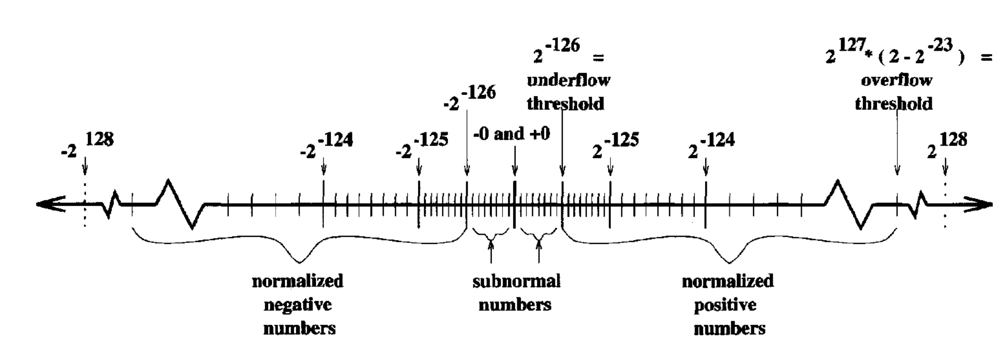

# 1.5 浮点运算(Floating Point Arithmetic)

-3.1416 的**科学计数法**表示为：

$$
-.31416\times 10^1
$$

* 基(base) 
* 分数(fraction)
* 指数(exponent)
* 符号(sign)

计算机用类似的方式来表示数字， 称为**浮点数(floating point)**， 如：

$$
.10101_2\times 2^3 = 5.25_{10}
$$

如果尾数的第一位数是非零的数，则称对应的浮点数为**规约(normalized)**的, 如

$$
.10101_2\times 2^3 \\
.010101_2\times 2^4
$$

* 规约确保每个浮点数都用一个唯一的二进制串来表示。
* 规约形式的浮点数第一位永远为 1, 实际上可以不存储，尾数多了一位来更精确地表示数。
* 基是浮点数最重要的参数。
* 分数的位数决定了浮点数的表示精度
* 指数决定了浮点数能表示的最大最小值范围。
* 不同的浮点数还表现在其它方面，如
    + 如何处理舍入
    + 如何处理 underflow 和 overflow
    + 是否允许 $$\pm\infty$$
    + NaN (Not a Number)

## 浮点数的表示误差

浮点数 $$ 0.31416\times 10^1 $$ 有 5 个 10 进制数字表示，故所有小于 $$ 0.5\times
10^{-4} $$ 的信息可能被丢失这意味着若 $$x$$ 是一个实数，其最佳的 5 位数字近似数
是 $$0.31416 \times 10^1$$, 则在 $$0.31416 \times 10^1$$ 中的 **相对表示误差**是
:

$$
\frac{|x - 0.31416\times10^1|}{0.31416\times10^1}\le\frac{0.5\times10^{-4}}{0.31416\times10^1}\approx0.16\times10^{-4}
$$

在一个 $$p$$ 位数字和基为 $$\beta$$ 的浮点运算中的**最大相对表示误差**是

$$
0.5\times\beta^{1-p},
$$

它是 1 和下一个最大的浮点数 $$1 + \beta^{1-p}$$ 之间距离的一半。

以 10 进制有 5 位尾数的浮点数为例，区间 $$[0.999995, 1.00005)$$ 之间的数的浮点数
表示都为 

$$
.10000\times 10^1
$$

其最大的表示误差为

$$
0.5\times 10^{1-5} = 0.5\times 10^{-4}
$$

## IEEE 浮点数标准

**IEEE Single precision**

* 符号 $$s$$: 1 位
* 指数 $$e$$: 8 位
* 分数 $$f<1$$: 23 位

其表示的数为

$$ 
(-1)^s\cdot 2^{e-127} \cdot (1 + f) 
$$

* 最大相对表示误差 $$0.5\times 2^{1 - 24} = 2^{-24} \approx 6\cdot 10^{-8}$$。
* 下界为 $$2^{-126}$$ ($$ 10^{-38}$$, underflow threshold)。
* 上界为 $$2^{127}\cdot (2 - 2^{-23}) \approx 2^{128}$$ ($$ 10^{38}$$, overflow threshhold)。

**IEEE Double precision**

* 符号 $$s$$: 1 位
* 指数 $$e$$: 11 位
* 分数 $$f<1$$: 52 位

其表示的数为

$$ 
(-1)^s\cdot 2^{e-1023} \cdot (1 + f) 
$$

* 最大相对表示误差 $$0.5\times 2^{1 - 54} = 2^{-54} \approx 6\cdot 10^{-16}$$。
* 下界为 $$2^{-1022}$$ ($$ 10^{-308}$$, underflow threshold)。
* 上界为 $$2^{1023}\cdot (2 - 2^{-52}) \approx 2^{128}$$ ($$ 10^{308}$$, overflow threshhold)。

## 舍入误差 (Roundoff Error)

当计算 $$a\odot b$$ 时（ $$\odot$$ 可以是加、减、乘、除四种运算中的任意一种），
其结果不能精确地表示成一个浮点数，则它被放到内存或寄存器之前，必须用一个邻近的浮
点数来近似表示。 用 $$\text{fl}(a\odot b)$$ 表示这个近似, 则称

$$ 
(a\odot b) - \text{fl}(a\odot b)
$$ 

为**舍入误差**。

若 $$fl(a\odot b)$$ 是一个最接近于 $$a\odot b$$ 的浮点数，则称运算进行了**正确地
舍入**。 当正确地舍入时，且 $$a\odot b$$ 没有溢出，则记

$$
fl(a\odot b) = (a\odot b)(1 + \delta)
$$

其中 $\abs\delta$ 以 $\varepsilon$ 为界， 称 $\varepsilon$ 为**机器精度**
(machine epsilon, machine precision, or macheps)。

* $$ \varepsilon = 0.5\cdot\beta^{1-p}$$
* IEEE 标准的浮点运算也保证 $$\text{fl}(\sqrt{a}) = \sqrt{a}(1 + \delta)$$ 
