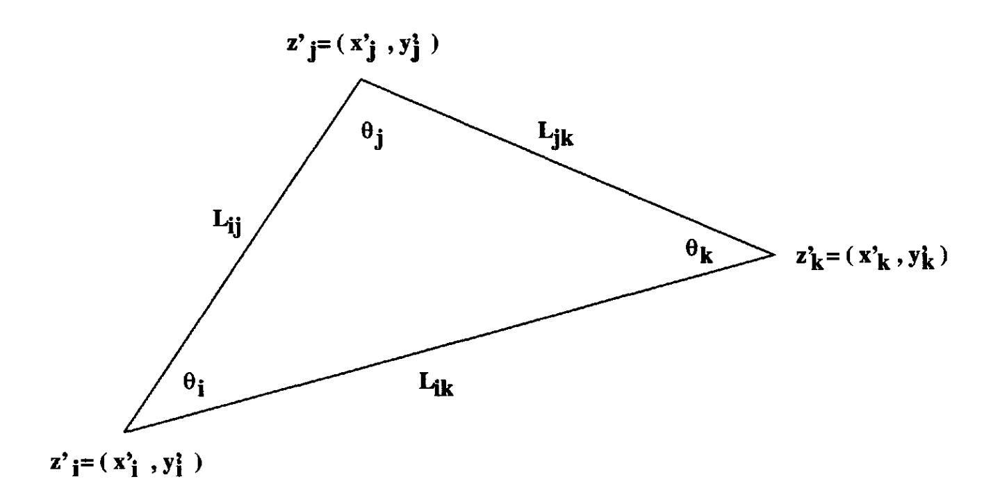

# 简介

$$
\min \left\| Ax - b\right\|_2
$$ 

* $$A_{m\times n}$$ 
* $$b_{n\times 1}$$
* $$m > n$$, 超定问题(overdetermined)
* $$m < n$$, 欠定问题(underdetermined)

**例子 3.1** 曲线拟合问题

给定一组数据点
$$
(y_1, b_1), \ldots, (y_m, b_m)
$$ 

找到一个“最好”的三次多项式，拟合 $$b_i$$ 为 $$y_i$$ 的函数。


```python
# numpy.polyfit(x, y, deg)
>>> x = np.array([0.0, 1.0, 2.0, 3.0,  4.0,  5.0])
>>> y = np.array([0.0, 0.8, 0.9, 0.1, -0.8, -1.0])
>>> z = np.polyfit(x, y, 3)
>>> z
array([ 0.08703704, -0.81349206,  1.69312169, -0.03968254])
```

* 上面拟合的多项式中 $$1, x, x^2, \cdots, x^k$$ 

```python
import numpy as np
import matplotlib.pyplot as plt

f = lambda y: np.sin(np.pi*y/5) + y/5
y = np.linspace(-5, 6, num=23)
b = f(y)
deg = [1, 3, 6, 19, 30]
p =[]
for d in deg:
    p.append(np.polyfit(y, b, d))
print(p[3])

fig = plt.figure()
axes = fig.gca()
# plot the true function
y1 = np.linspace(-5, 6, num=1000)
axes.set_xlim((-10, 10))
axes.set_ylim((-3, 3))
axes.set_aspect('auto')
axes.plot(y1, f(y1))

# plot the fit polynomial
y2 = np.linspace(-10, 10, num=1000)
for p0 in p:
    print(len(p0))
    b2 = np.polyval(p0, y2)
    axes.plot(y2, b2, label=str(len(p0)-1))
axes.plot(y, b,'ko',label='raw data')
axes.legend()


p = []
for d in range(1, 20):
    p.append(np.poly1d(np.polyfit(y, b, d)))
    
r = np.zeros((19,))
for i in range(0, 19):
    r[i] = np.linalg.norm(p[i](y) - b, 2)
fig1 = plt.figure()
axes1 = fig1.gca()
axes1.set_ylim((0, 0.01))
axes1.plot(range(1, 20), r, 'k+')
```


**例子 3.2** 统计建模问题: 大一新生的大学平均成绩预测。

知道一组大学生入学时的三种成绩，及大学平均成绩：
* $$a_{i1}$$: 高中平均成绩
* $$a_{i2}$$: 口语成绩
* $$a_{i3}$$: 数学成绩
* $$b_i$$: 大学平均成绩
建立线性回归模型，用来预测大一新生的大学平均成绩。

$$
r \equiv 
\left[\begin{array}{c}
{r_{1}} \\ {r_{2}} \\ {\vdots} \\ {r_{m}}
\end{array}\right]
= \left[ \begin{array}{ccc}
{a_{11}} & {a_{12}} & {a_{13}} \\
{a_{21}} & {a_{22}} & {a_{23}} \\ 
{\vdots} & {\vdots} & {\vdots} \\
{a_{m 1}} & {a_{m 2}} & {a_{m 3}}
\end{array}\right] 
\cdot \left[
\begin{array}{c}
{x_{1}} \\ {x_{2}} \\ {x_{3}}
\end{array}\right]
-\left[
\begin{array}{c}
{b_{1}} \\ {b_{2}} \\ {\vdots} \\ {b_{m}}
\end{array}\right]
\equiv A \cdot x-b
$$ 

**例子 3.3 大地测量学：** 很多国家每隔一段时间，都会对国土进行大地测量，以更新
国土上大量地标的位置信息，这些信息包括地标的经度、纬度和海拔高度。这些地标的位
置信息对国家的基础工程规划和建设及研究地壳的移动都有重要的参考价值。

为简单起见，这里假设地球是平的。进一步假设我们有 $$N$$ 个地标的位置需要更新，每个地标有两
个分量 $$z_i = (x_i, y_i)^T$$。

大地测量时，会测量邻近地标距离及邻近地标连续之间的夹角，依据这些最新的测量结果
，给每个地标位置一校正量 $$\delta z_i = (\delta x_i, \delta y_i)$$。这些校正
量要尽量使得邻近地标之间的距离和角度接近最新的测量结果。



$$
\cos ^{2}
\theta_{i}=\frac{
\left[\left(z_{j}^{\prime}-z_{i}^{\prime}\right)^{T}\left(z_{k}^{\prime}-z_{i}^{\prime}\right)\right]^{2}
}{
\left(z_{j}^{\prime}-z_{i}^{\prime}\right)^{T}
\left(z_{j}^{\prime}-z_{i}^{\prime}\right)
\cdot
\left(z_{k}^{\prime}-z_{i}^{\prime}\right)^{T}
\left(z_{k}^{\prime}-z_{i}^{\prime}\right)
}
$$ 

