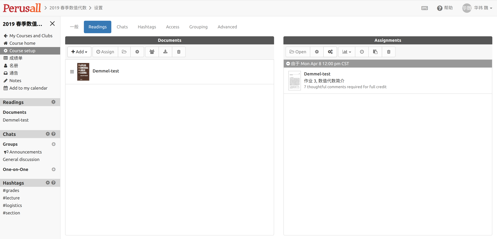

# Perusall 网络课程平台

本课程将借助 Perusall 平台辅助教学，其网址为：
[www.perusall.com](www.perusall.com)。 我们将通过 Perusall 做以下事情

1. 阅读作业
1. 交流讨论

## 使用简介 

### 注册

湘潭大学为每位学生免费提供一个电子邮箱，容量无限，可发2G超大附件。在校期间，该邮
箱是学生信息沟通的重要工具；毕业后可继续使用。现将有关事项说明如下：

1. 访问地址：[https://mail.smail.xtu.edu.cn/](https://mail.smail.xtu.edu.cn/) 。
1. 账号：学号@smail.xtu.edu.cn。
1. 初始密码：Xtu（X为大写）加身份证后六位。
1. 用户初次登录邮箱，需立即修改密码。
1. 密码设置规则：大小写字母+数字（8－24位）。
1. 绑定密保邮箱，可自动找回密码。
1. 故障报修及咨询发mail@xtu.edu.cn解决。  

要求参加课程的每位学生，使用**湘大学生邮箱**进行注册，使用自己的真实姓名。

注册完成后，使用课程码 `-3CA6E` 进入课程学习。

### 阅读作业

课程将通过 Perusall 布置阅读作业，

在阅读作业材料时，学生可以通过鼠标来选择单词、句子或者段落，在作业材料页面右测会
弹出一个对话列表。列表中有一个初始的对话框，可以输入评论和问题，按回车键即可发送
，进入下一个对话框。

在做作业时，要注意以下事情：

* 选择要评论的内容时，选择范围要尽量的小，集中到你的问题所在的地方。
* 注意对话框中支持 Markdown 标记语言， 特别是数学公式的输入，
    + `\(x^2 + y^2 = 1\)`: $$x^2 + y^2 =1$$
    + `\(\sum x_i \)`: $$\sum x_i$$
* 在评论中要提到另外一个学生，`@用户名`
* 请认真写自己的评论，并积极参与讨论。Perusall 会根据学生的评论情况，自动对作业
  进行打分。该分数会记入平时成绩。
* 教师将根据学生的讨论情况及反映的问题，在课堂上重点讲解相关内容。 

 
